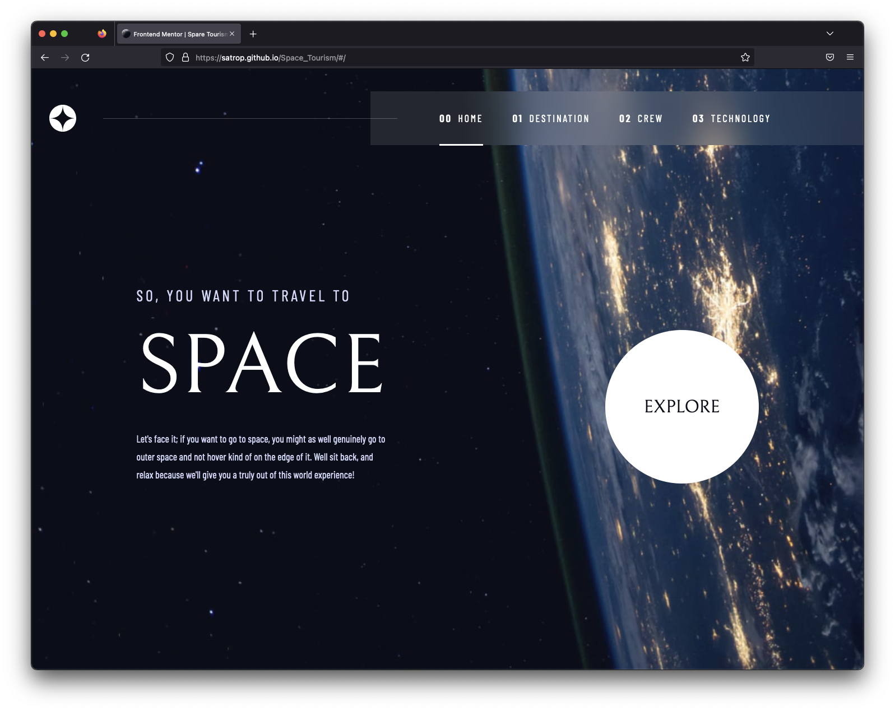

# [Frontend Mentor - Space Tourism](https://www.frontendmentor.io/challenges/space-tourism-multipage-website-gRWj1URZ3)

## Overview

-   [Live Site](https://satrop.github.io/Space_Tourism/)



## My process

### Built with ❤️

-   Semantic HTML5 markup
-   SCSS with custom properties
-   Flexbox
-   CSS Grid
-   Mobile-first workflow
-   React

### What I learned

I'm hoping I have now nailed down the page refresh issues that gh-pages has with multi page React apps thanks to `<HashRouter>`

```jsx
<HashRouter>
	<Routes>
		<Route path="/" exact element={<Layout />}>
			<Route index element={<Home />} />
			<Route path="/destination" element={<Destination />} />
			<Route path="/crew" element={<Crew />} />
			<Route path="/technology" element={<Technology />} />
		</Route>
	</Routes>
</HashRouter>
```
